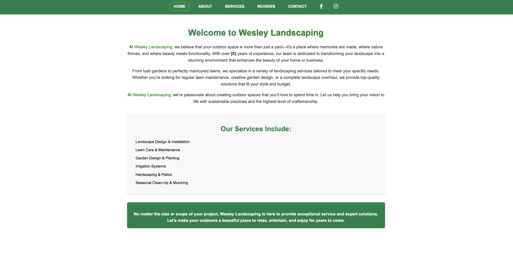
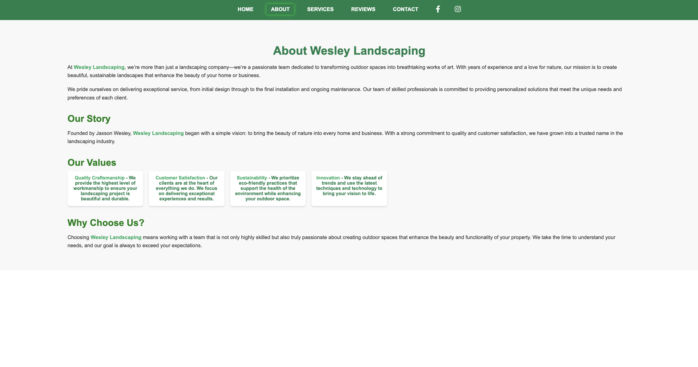
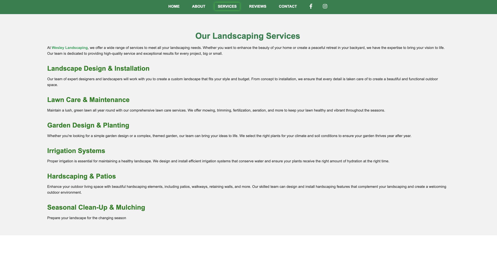
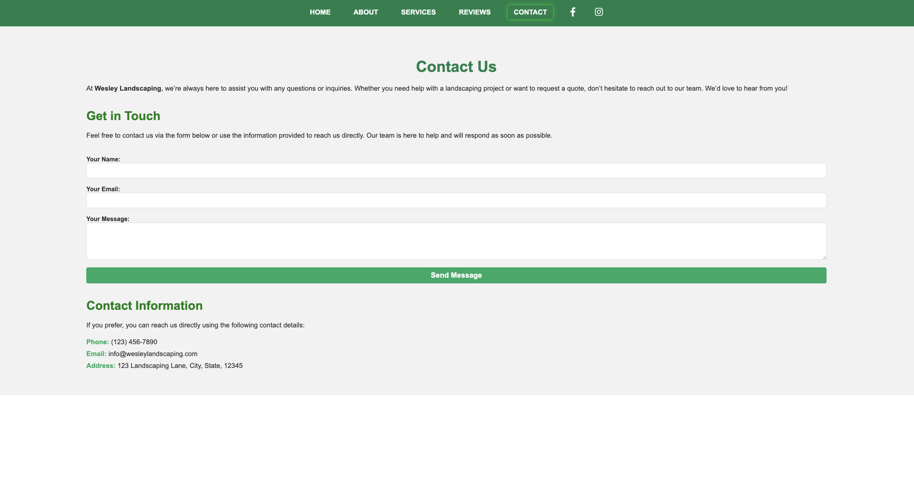

# Wesley Landscaping Website

Welcome to the **Wesley Landscaping** website! This website is designed to showcase our landscaping services, reviews, contact information, and more. The website is built with Angular for the frontend and includes an interactive navigation menu with sections like Home, About, Services, Reviews, and Contact.

## Features

- **Responsive Design**: The website is optimized for mobile and desktop devices.
- **Menu Bar**: Contains links to various sections with social media icons on the right.
- **About Page**: Learn more about Wesley Landscaping and our mission.
- **Services Page**: Explore the landscaping services we offer.
- **Reviews Page**: Customers can leave their feedback and see reviews from others.
- **Contact Page**: Reach out to us via a contact form or find our contact information.

## Screenshots

### Home Page


### About Page


### Services Page


### Reviews Page


### Contact Page


## Installation

To run the website locally, follow these steps:

### Prerequisites
- **Node.js** (v14 or later) and **npm** installed on your system.
- **Angular CLI** installed globally. You can install it using the following command:
  ```bash
  npm install -g @angular/cli
  ng serve --open
